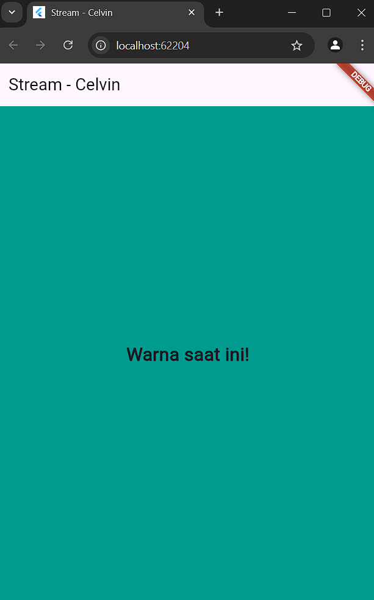
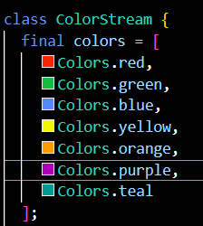
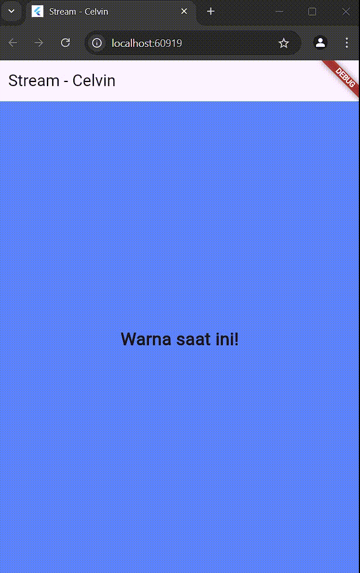
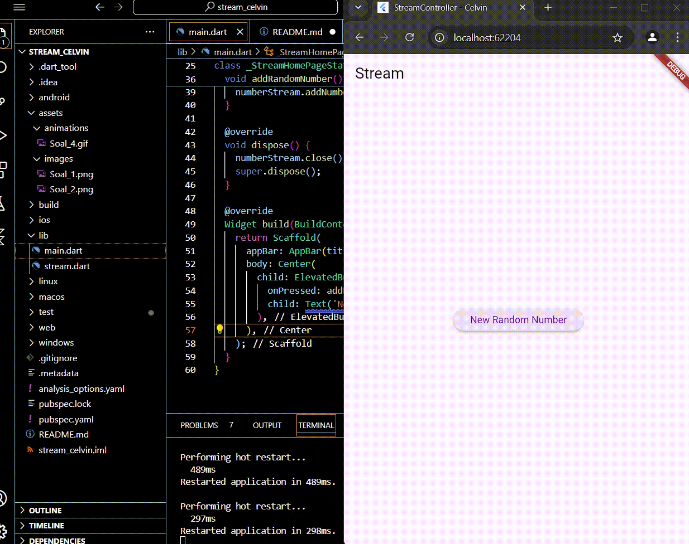
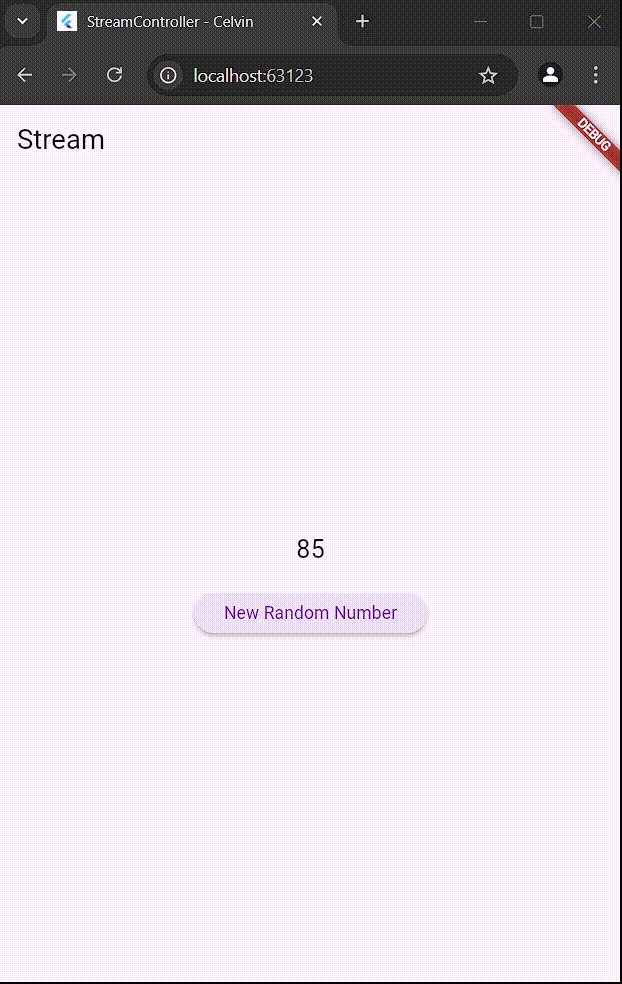
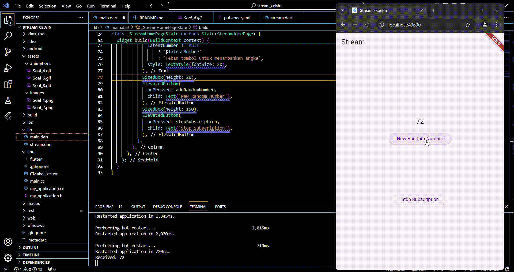
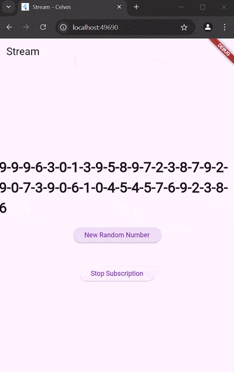
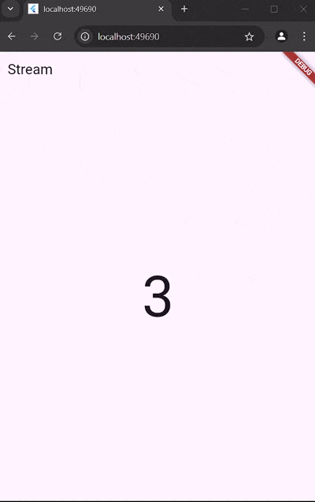
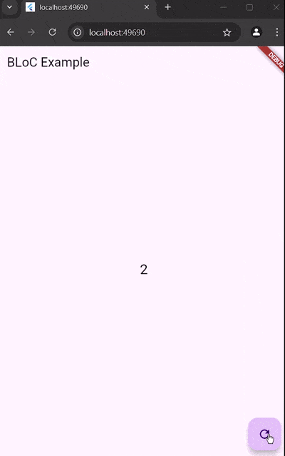

# stream_celvin

Lanjutan State Management Dengan Stream

## Praktikum Stream
## Celvin Alfiansyah (362358302104)
## 2D TRPL
# Soal 1.

# Soal 2.

# Soal 3.
- Fungsi yield*: yield* digunakan untuk menggabungkan seluruh elemen dari stream lain ke dalam stream utama. Dengan kata lain, yield* akan mendengarkan stream yang lain dan meneruskan data tersebut ke subscriber.
- Maksud kode Stream.periodic: Kode ini menghasilkan warna setiap detik secara berkala. Indeks dihitung menggunakan modulus (%) agar warna berulang jika indeks melebihi jumlah warna yang tersedia.

# Soal 4.

# Soal 5.
Perbedaan listen dan await for : 
- listen digunakan untuk mendapatkan data dari stream secara manual dan memberikan callback setiap ada data baru.
- await for digunakan dalam fungsi async untuk menunggu dan memproses setiap data yang masuk secara sekuensial.

# Soal 6.
- Langkah 8 (initState):
initState digunakan untuk menginisialisasi listener pada stream. Ini memastikan bahwa setiap data yang masuk ke stream akan diterima dan diproses.
- Langkah 10 (addRandomNumber):
Fungsi ini membuat angka acak menggunakan Random() dan menambahkannya ke dalam StreamController melalui addNumberToSink().

# Soal 7.
Maksud kode Langkah 13-15 :
- Langkah 13: Menambahkan error handler menggunakan onError untuk menangkap error dari stream.
- Langkah 15: Menggunakan addError untuk mengirimkan error ke dalam stream.

# Soal 8.
Maksud kode Langkah 1-3 :
- Variabel baru dibuat untuk menyimpan stream yang telah diubah.
- Stream dimodifikasi menggunakan StreamTransformer untuk filter angka genap (where) dan mengubahnya menjadi string (map).

# Soal 9.
- Langkah 2:
initState digunakan untuk mengatur subscription dan mendengarkan stream dengan menangani data dan error.
- Langkah 6 (dispose):
Fungsi dispose membersihkan subscription untuk mencegah kebocoran memori.
- Langkah 8:
Fungsi addRandomNumber() menambahkan angka baru ke stream.

# Soal 10.
- Mengapa Error Terjadi?
Secara default, stream hanya mendukung single subscription. Jika ada lebih dari satu subscriber, akan terjadi error.

# Soal 11.
- Mengapa bisa terjadi?
Setelah stream diubah menjadi broadcast stream, stream dapat memiliki lebih dari satu subscriber.

# Soal 12.
Maksud kode Langkah 3 dan 7 :
- Langkah 3: Stream dibuat untuk menghasilkan data secara berkala menggunakan Stream.periodic.
- Langkah 7: StreamBuilder digunakan untuk mendengarkan stream dan membangun ulang UI setiap kali ada data baru.

# Soal 13.
Maksud praktikum ini :
- Praktikum ini menunjukkan bagaimana implementasi pola BLoC memisahkan logika bisnis dari UI.
Konsep BLoC :
- Logika bisnis dikelola di dalam StreamController.
- Data dikirim ke UI melalui stream dan di-trigger oleh aksi pengguna.

